# FictionForge Agentic System Architecture

This document describes the tiered, ReAct-inspired agentic orchestration system that powers FictionForge's AI assistance. The system classifies user requests into cognitive tiers, retrieves the minimum necessary project context, and routes to the appropriate generation strategy — all while staying within the user's configured model's token budget.

---

## Table of Contents

1. [Design Philosophy](#design-philosophy)
2. [High-Level Architecture](#high-level-architecture)
3. [Task Classification](#task-classification)
4. [Context Retrieval](#context-retrieval)
5. [Token Budgeting](#token-budgeting)
6. [The Four Tiers](#the-four-tiers)
   - [QUICK_EDIT](#quick_edit)
   - [CONTENT_GEN](#content_gen)
   - [RESEARCH](#research)
   - [DEEP_WORK](#deep_work)
7. [Skills System](#skills-system)
8. [Activity Logging](#activity-logging)
9. [Request Flow Diagrams](#request-flow-diagrams)

---

## Design Philosophy

> **"Retrieve only what you need, and no more."**

FictionForge's agentic system is built on three principles:

1. **Tiered Cognition** — Not every request needs deep reasoning. A typo fix should not trigger a 5-step ReAct loop. The system uses fast heuristics to route simple requests directly to the writing model.

2. **Semantic Context Retrieval** — Instead of dumping the entire project into the prompt, the system embeds the user's request and retrieves only the most relevant documents, characters, and world-building entries via local vector search (384-dim BGE-small embeddings, no cloud dependency).

3. **Token Discipline** — Every piece of injected context is budgeted. If the context won't fit, it is truncated intelligently (at sentence boundaries) rather than hard-cut at token limits.

---

## High-Level Architecture

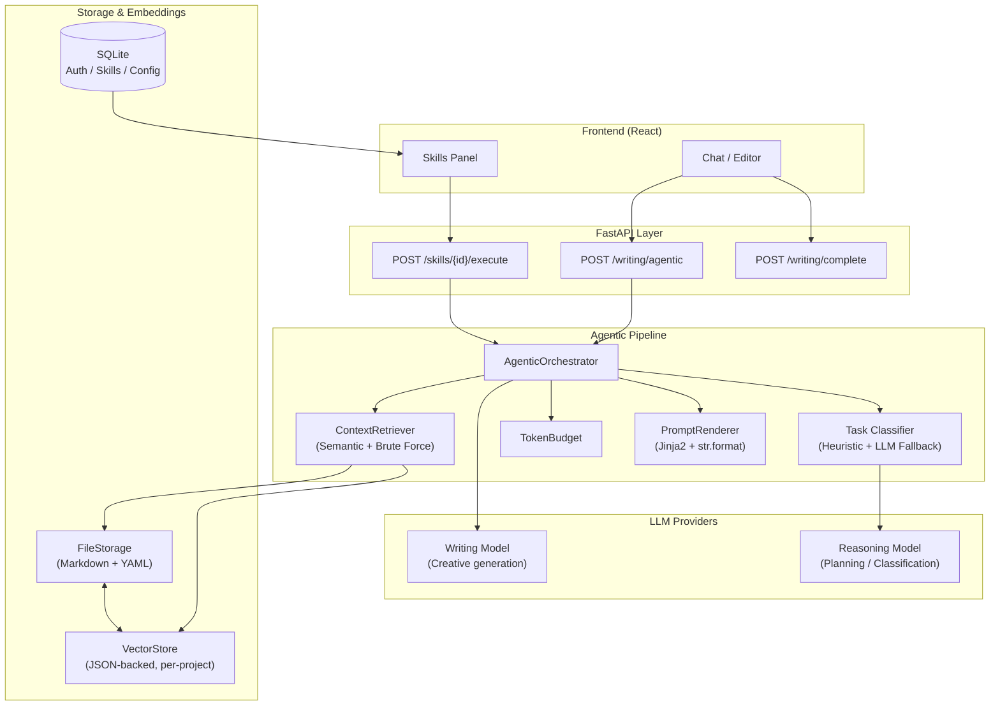

### Key Components

| Component | File | Role |
|-----------|------|------|
| `AgenticOrchestrator` | `services/ai/agentic_orchestrator.py` | Central router. Classifies, retrieves, budgets, injects, generates. |
| `classify_task` | `services/ai/task_classifier.py` | Hybrid heuristic + LLM classifier. |
| `ContextRetriever` | `services/ai/context_retriever.py` | Fetches project context by tier. Uses semantic search when available. |
| `TokenBudget` | `services/ai/token_budget.py` | Tracks and enforces token limits with graceful truncation. |
| `render_prompt` | `services/ai/prompt_renderer.py` | Unified template rendering (Jinja2 + Python format). |
| `WebSearchTool` | `services/ai/web_search.py` | DuckDuckGo-based research (no API key). |
| `VectorStore` | `services/ai/vector_store.py` | JSON-backed cosine similarity search with chunking. |
| `EmbeddingService` | `services/ai/embeddings.py` | Local ONNX embeddings via `fastembed` (BAAI/bge-small-en-v1.5). |

---

## Task Classification

Every user request is classified into one of four tiers before any context is fetched. This prevents over-fetching for simple tasks.

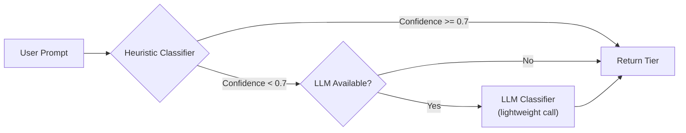

### Classification Heuristics

The heuristic classifier (`classify_task_heuristic`) uses these signals in priority order:

1. **Action name** (highest confidence) — e.g. `rewrite` -> `QUICK_EDIT`, `create_character` -> `DEEP_WORK`
2. **Document type + field name** — e.g. editing a character's `name` field -> `QUICK_EDIT`; editing `background` -> `CONTENT_GEN`
3. **Keyword matching** — e.g. "research Victorian London" -> `RESEARCH`; "draft a chapter" -> `DEEP_WORK`
4. **Prompt length** — very short prompts with edit keywords -> `QUICK_EDIT`

### The Four Tiers

| Tier | Description | Context Needed | Reasoning |
|------|-------------|----------------|-----------|
| `QUICK_EDIT` | Rewrite, shorten, expand, synonym | None | Direct LLM call |
| `CONTENT_GEN` | Continue story, generate prose | Style guide + outlines + relevant characters/world | Semantic fetch |
| `RESEARCH` | Real-world facts, history, etymology | Style guide + story bible + web search | Semantic fetch + web search |
| `DEEP_WORK` | Draft chapter, create character, plan story | Full project context via planner | Multi-step ReAct |

---

## Context Retrieval

The `ContextRetriever` fetches project content based on the classified tier. It has two modes:

### Mode 1: Semantic Search (Preferred)

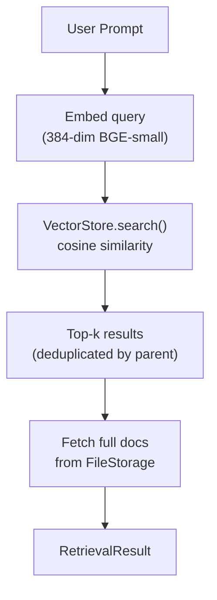

- The prompt is embedded locally using `fastembed` (ONNX, no PyTorch, ~33MB model).
- The vector store performs cosine similarity against all project embeddings.
- Long documents are pre-chunked (>500 words, 50-word overlap) into separate vectors with IDs like `{parent_id}_chunk_0`. Search deduplicates by parent so only the full document is returned.
- Results are categorized by module (`Writing`, `Notes`, `Characters`, `StoryBible`, `StyleGuide`, `StoryPlan`) and full content is fetched from `FileStorage`.

### Mode 2: Brute-Force Fallback

If embeddings are unavailable (e.g. first use, rebuild pending), the retriever falls back to rule-based fetching:

- `CONTENT_GEN`: All style guide entries + all outlines + characters/story bible (if editing those types)
- `RESEARCH`: Style guide + story bible + characters (if relevant)
- `DEEP_WORK`: Everything — style guide, outlines, characters, story bible, recent documents

### Semantic Search Savings

| Tier | Before (brute-force) | After (semantic) | Savings |
|------|----------------------|------------------|---------|
| `CONTENT_GEN` | ~8,000-12,000 tokens | ~2,000-4,000 tokens | **50-60%** |
| `DEEP_WORK` | ~20,000-40,000 tokens | ~4,000-8,000 tokens | **70-80%** |

---

## Token Budgeting

Before injecting context into the prompt, the system ensures it will fit within the model's context window.

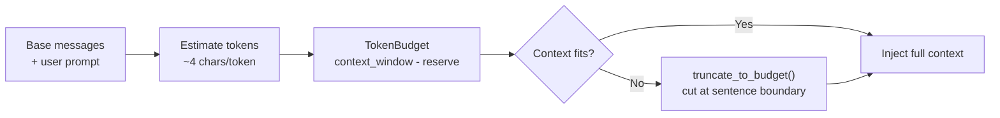

### Budget Rules

- **Context window**: Auto-detected by model name (128K default; 32K for Haiku/8K models).
- **Reserve**: 2,000 tokens always reserved for the user's prompt and the model's response.
- **Truncation**: If context exceeds budget, it is truncated at the last sentence boundary within budget, with `[truncated]` appended.

---

## The Four Tiers in Detail

### QUICK_EDIT

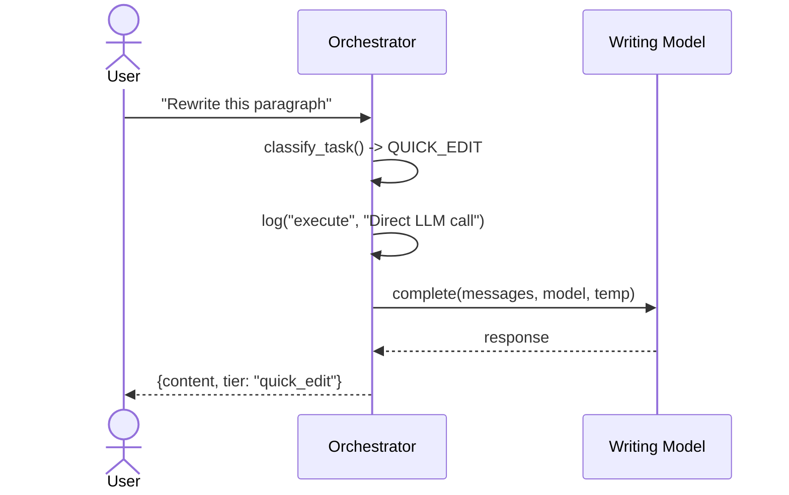

**Behavior**: Zero context retrieval. The user's messages are sent directly to the writing model. Fastest path.

---

### CONTENT_GEN

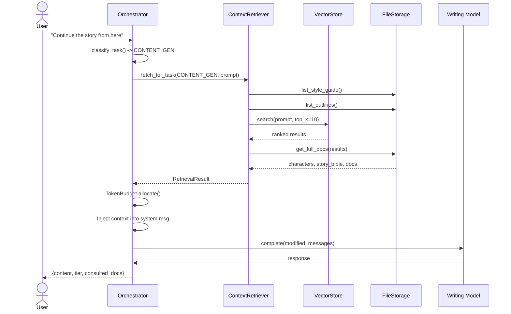

**Behavior**: Always fetches style guide + outlines. Tries semantic search for supplemental context (characters, story bible, relevant documents/notes). Falls back to brute-force if embeddings unavailable.

---

### RESEARCH

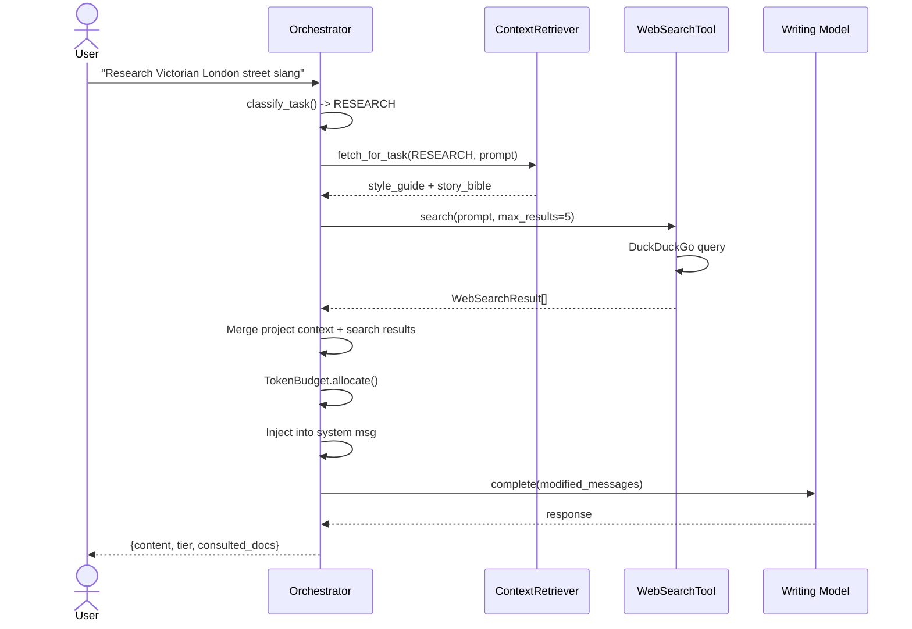

**Behavior**: Fetches project context (style guide + story bible for world consistency) + performs a live DuckDuckGo web search. Results are formatted and injected alongside project context.

---

### DEEP_WORK (Multi-Step ReAct)

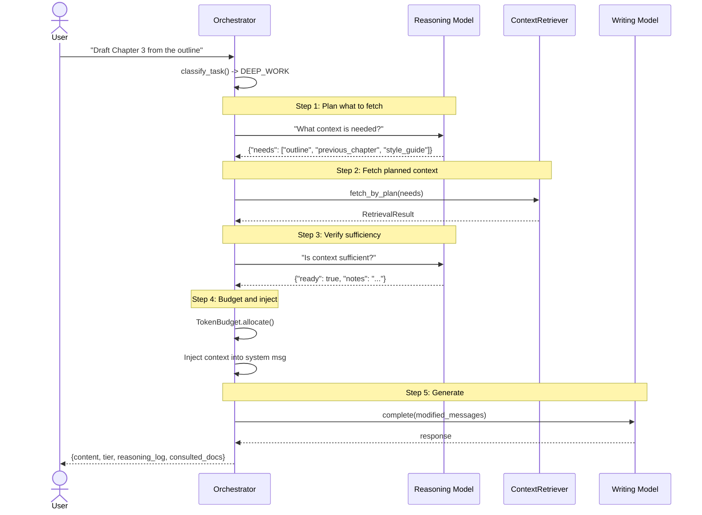

**Behavior**: The only tier that uses the **Reasoning Model** (can be a separate, cheaper model like GPT-4o-mini or Haiku):

1. **Planner**: The reasoning model analyzes the request and outputs a JSON `needs` array (e.g. `["style_guide", "outline_current_act", "previous_chapter"]`).
2. **Fetch**: `ContextRetriever.fetch_by_plan()` loads exactly what was requested.
3. **Verifier**: The reasoning model checks if the fetched context is sufficient. If not, the orchestrator proceeds anyway but logs the deficiency.
4. **Budget + Inject**: Context is token-budgeted and injected into the system message.
5. **Generate**: The writing model produces the final response.

**Token Budget for DEEP_WORK**: Up to 16,000 tokens of context (after budget checks).

---

## Skills System

Skills are user-defined prompt templates with optional agentic context retrieval. They live in SQLite and can be created, edited, and executed from the frontend.

```mermaid
flowchart TB
    subgraph SkillDef["Skill Definition (SQLite)"]
        Name["name: 'Enrich Scene'"]
        Prompt["prompt_template: Jinja2"]
        Sys["system_prompt: optional"]
        Vars["variables: JSON schema"]
        Sources["context_sources: ['outline', 'characters']"]
        Agentic["is_agentic: true/false"]
    end

    subgraph Execution["Skill Execution"]
        Render["render_prompt()<br/>Jinja2 + user context"]
        AgenticCheck{"is_agentic?"}
        Direct["Return rendered prompt<br/>(client calls writing endpoint)"]
        AgenticRun["Run through<br/>AgenticOrchestrator"]
    end

    SkillDef --> Render
    Render --> AgenticCheck
    AgenticCheck -->|No| Direct
    AgenticCheck -->|Yes| AgenticRun
    AgenticRun --> C[ContextRetriever.fetch_by_plan(sources)]
    C --> W[Writing Model]
```

### Skill Context Sources

When `is_agentic=true`, the skill specifies which project content to fetch via `context_sources`:

```json
["style_guide", "outline", "character_Elara", "story_bible", "previous_chapter", "notes"]
```

The `fetch_by_plan` method resolves these into actual storage calls:
- `"style_guide"` -> `list_style_guide()`
- `"outline"` -> `list_outlines()`
- `"character_<name>"` -> finds character by name
- `"previous_chapter"` -> last non-note document
- `"notes"` -> all note-type documents

### Built-in System Skill Overrides

The orchestrator loads three built-in prompts from the skills library (falling back to hardcoded defaults):

| Skill ID | Purpose | Used By |
|----------|---------|---------|
| `Task_Classifier` | Classification prompt template | `classify_task_llm()` |
| `Reasoning_Planner` | DEEP_WORK planning prompt | `AgenticOrchestrator.run()` |
| `Reasoning_Verifier` | DEEP_WORK verification prompt | `AgenticOrchestrator.run()` |
| `Fallback_System` | Default system prompt | Context injection fallback |

Users can override these by creating skills with matching IDs, allowing customization of the agentic reasoning without code changes.

---

## Activity Logging

Every AI interaction is logged asynchronously for transparency and debugging:

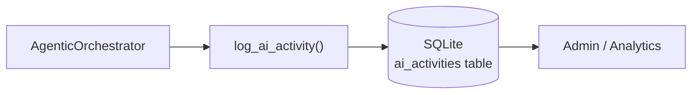

Logged fields:
- `request_type`: `direct`, `stream`, `agentic`, `skill`
- `tier`: `quick_edit`, `content_gen`, `research`, `deep_work`
- `reasoning_log`: JSON array of orchestrator steps
- `consulted_docs`: List of documents/characters that contributed context
- `context_length`: Characters of injected context
- `latency_ms`: End-to-end response time
- `error`: If the call failed

---

## Request Flow Diagrams

### Full Agentic Request (Chat / Editor)

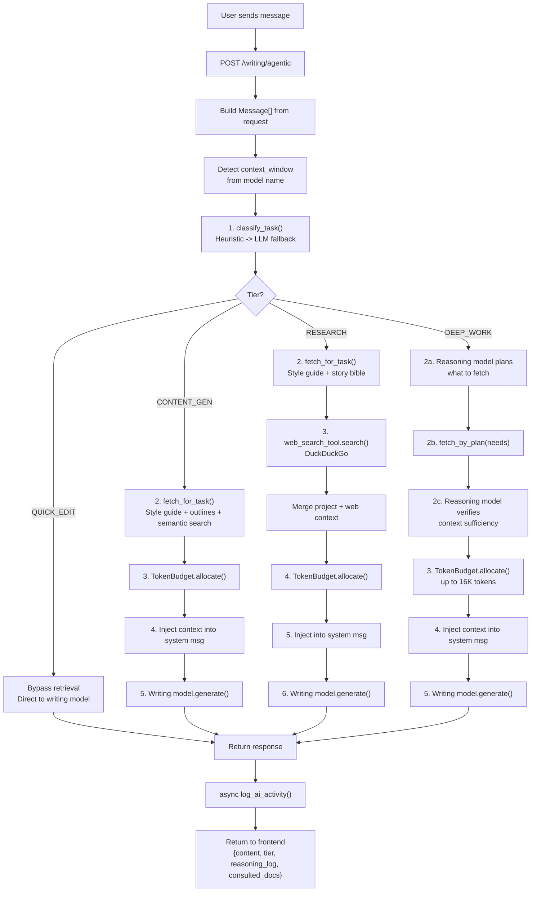

### Skill Execution Flow

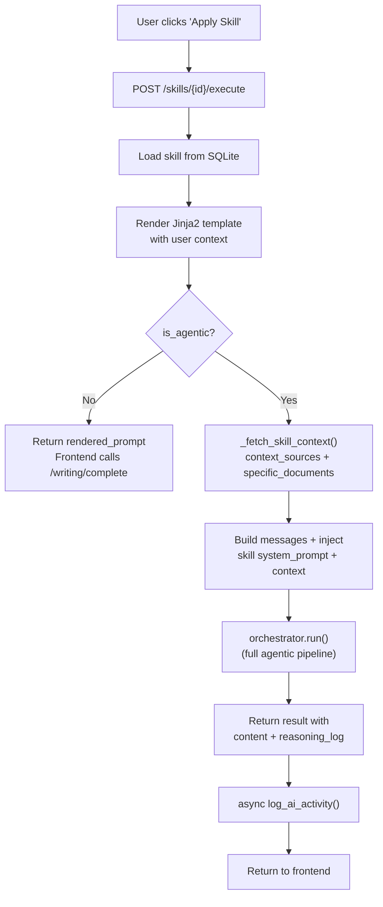

---

## File Reference

| File | Lines | Description |
|------|-------|-------------|
| `backend/app/services/ai/agentic_orchestrator.py` | ~374 | Central orchestrator. Tiers, context retrieval, budgeting, injection, generation. |
| `backend/app/services/ai/task_classifier.py` | ~270 | Hybrid classifier with heuristic and LLM fallback paths. |
| `backend/app/services/ai/context_retriever.py` | ~342 | Semantic and brute-force context fetching by tier. |
| `backend/app/services/ai/token_budget.py` | ~91 | Token estimation, budgeting, and graceful truncation. |
| `backend/app/services/ai/prompt_renderer.py` | ~122 | Jinja2 + str.format dual-mode template rendering. |
| `backend/app/services/ai/web_search.py` | ~71 | DuckDuckGo search abstraction. |
| `backend/app/services/ai/embeddings.py` | ~60 | fastembed-based local embedding service. |
| `backend/app/services/ai/vector_store.py` | ~280 | JSON-backed cosine similarity with chunking. |
| `backend/app/api/v1/writing.py` | ~307 | `/complete`, `/stream`, `/agentic` endpoints. |
| `backend/app/api/v1/skills.py` | ~322 | Skills CRUD + `/apply` + `/execute` endpoints. |
| `backend/app/models/skill.py` | ~37 | SQLAlchemy Skill and SkillApplication models. |

---

## Testing

The agentic system has dedicated tests in `tests/`:

| Test File | Coverage |
|-----------|----------|
| `test_task_classifier.py` | Heuristic classification, keyword matching, confidence thresholds, LLM fallback |
| `test_context_retriever.py` | RetrievalResult formatting, tier-based fetching, semantic vs brute-force |
| `test_token_budget.py` | Budget allocation, truncation, sentence-boundary cutting |
| `test_web_search.py` | WebSearchTool formatting, result text generation |

Run: `cd tests && pytest -v` (31 tests, all passing).
